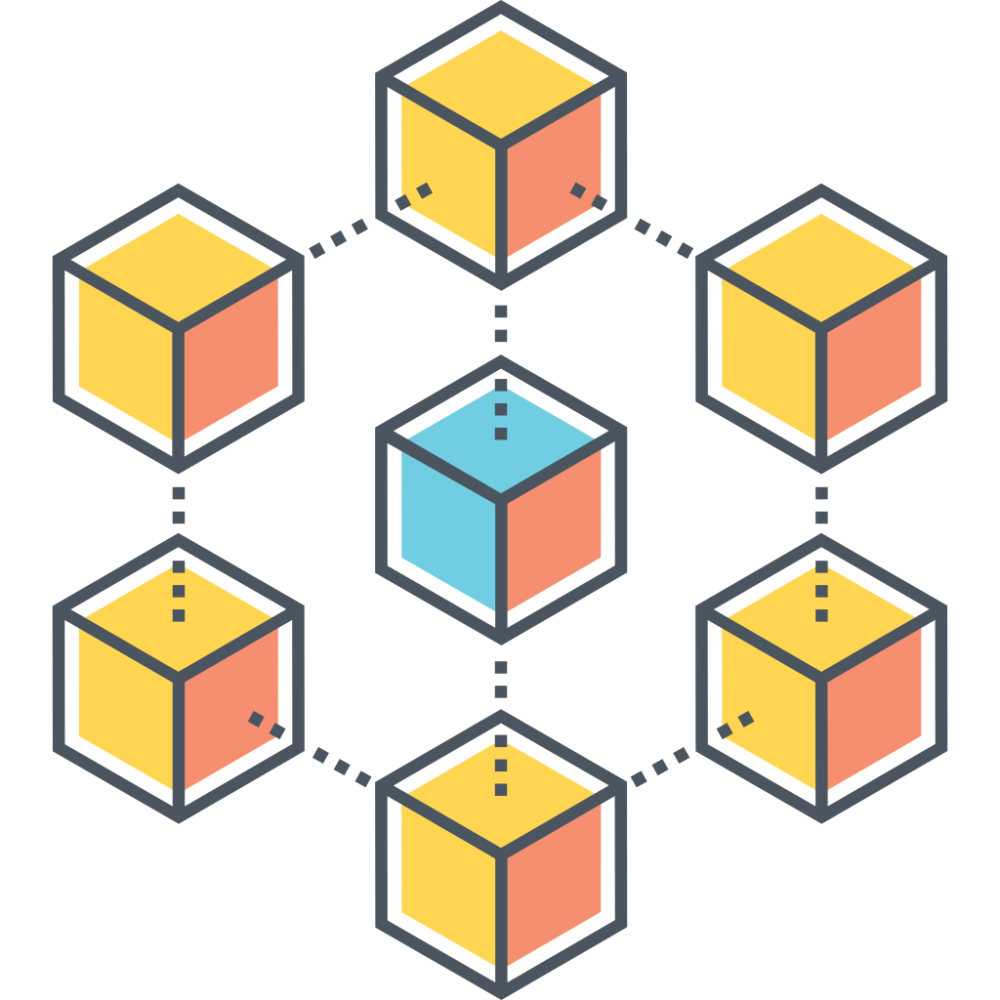
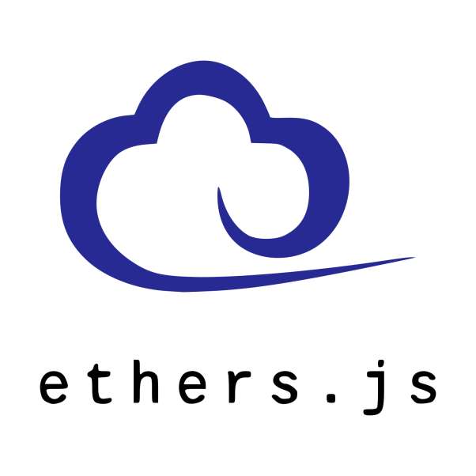
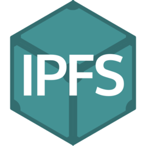
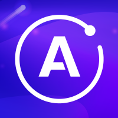

<a name="readme-top"></a>

<!-- PROJECT LOGO -->
<br />
<div align="center">
  <a href="https://github.com/levblanc/web3-blockchain-solidity-course-js">
    
  </a>

  <h2 align="center">Web3, Full Stack Solidity, Smart Contract & Blockchain development with JavaScript</h2>

  <p align="center">
    My Web3 full stack Solidity smart contract & blockchain development journey along with 
    <br />
    <a href="https://youtu.be/gyMwXuJrbJQ"> » this course from Patrick Collins</a>
  </p>
</div>

<br />

<!-- ABOUT THE PROJECT -->

## About The Project

Through out my journey with this course, I keep track of each lesson with
Github, pushed my codes to corresponding repos frequently.

The purpose of this master repo is to setup a connecting point of all my repos,
and as a demostration/documentation of the new skills acquired and the roadmaps
achieved.

<!-- GETTING STARTED -->

## Getting Started

1. Clone your target repo

```sh
# Repo links can be found in each challenge's README.md
# OR
# Click the chalenge badges below
git clone <repo-link-of-target-challenge>

# Example: cloning challenge 0
git clone https://github.com/levblanc/solidity-basics.git
```

2. Install dependencies with `yarn install` or `npm install`

## Skills Acquired

<p>
  
  
  
  
  
  
</p>
<p>
  
  
  
  
  
  
  
  
</p>
<p>
  
  
  
  
  
  
</p>

<!-- ROADMAP -->

## Full Course Journey

<a href="https://github.com/levblanc/solidity-basics"></a>

### Milestones

- [x] Blockchain basics
- [x] Solidity basics - languange syntax, gas & transactions
- [x] Compile & Deploy contracts (VM and Testnet)
- [x] Chainlink price feeds

### Skills

[![Solidity]](https://soliditylang.org/) [![Chainlink]](https://chain.link/)
[![Remix]](https://remix.ethereum.org/)

#

<a href="https://github.com/levblanc/solidity-ethersjs"></a>

### Milestones

- [x] Local development env setup
- [x] Work with Ganache for local blockchain networks
- [x] Work with Ether.js to create wallet & deploy contracts to testnet or
      mainnet
- [x] Interact with contract functions with Ethers.js
- [x] `.env` file & it's content management
- [x] Work with Alchemy as RPC provider
- [x] Verify contract on block explorer UI
- [x] Made everything compadible with Typescript

### Skills

[![Solidity]](https://soliditylang.org/)
[![EthersJS]](https://docs.ethers.io/v5/)
[![Ganache]](https://trufflesuite.com/ganache/)
[![JavaScript]](https://developer.mozilla.org/fr/docs/Web/JavaScript)
[![TypeScript]](https://www.typescriptlang.org/)
[![NodeJS]](https://nodejs.org/) [![Alchemy]](https://www.alchemy.com/)

#

<a href="https://github.com/levblanc/solidity-hardhat"></a>

### Milestones

- [x] Hardhat env setup
- [x] Hardhat networks & local node
- [x] Deploy contracts with Hardhat (local & testnet)
- [x] Programmatic Verification
- [x] Interacting with contracts in Hardhat
- [x] Hardhat tests & coverage reporter
- [x] Made everything compadible with Typescript

### Skills

[![Solidity]](https://soliditylang.org/)
[![JavaScript]](https://developer.mozilla.org/fr/docs/Web/JavaScript)
[![TypeScript]](https://www.typescriptlang.org/)
[![Hardhat]](https://hardhat.org/) [![Chai]](https://www.chaijs.com/)
[![Mocha]](https://mochajs.org/)

#

<a href="https://github.com/levblanc/solidity-hardhat-advanced"></a>

### Milestones

- [x] Testing with Chainlink mocks & helper-hardhat-config
- [x] Contract testing with Solidity console.log & VS Code breakpoints
- [x] Storage in Solidity
- [x] Gas Optimizations using storage knowledge
- [x] Staging Tests
- [x] Running Scripts on a Local Node
- [x] Adding scripts to your package.json

### Skills

[![Solidity]](https://soliditylang.org/)
[![JavaScript]](https://developer.mozilla.org/fr/docs/Web/JavaScript)
[![Hardhat]](https://hardhat.org/) [![Chai]](https://www.chaijs.com/)
[![Mocha]](https://mochajs.org/) [![Chainlink]](https://chain.link/)

#

<a href="https://github.com/levblanc/web3-lottery-hardhat"></a>

### Milestones

- [x] Chainlink VRF (Randomness in Web3)
- [x] Implementing Chainlink VRF - The Request
- [x] Implementing Chainlink VRF - The Fulfill
- [x] Introduction to Chainlink Keepers
- [x] Implementing Chainlink Keepers (checkUpKeep)
- [x] Implementing Chainlink Keepers (performUpKeep)
- [x] Enums
- [x] Use Mock Chainlink VRF Coordinator for unit tests
- [x] Hardhat Methods & "Time Travel"
- [x] Callstatic

### Skills

[![Solidity]](https://soliditylang.org/)
[![JavaScript]](https://developer.mozilla.org/fr/docs/Web/JavaScript)
[![TypeScript]](https://www.typescriptlang.org/)
[![Hardhat]](https://hardhat.org/) [![Chai]](https://www.chaijs.com/)
[![Mocha]](https://mochajs.org/) [![Chainlink]](https://chain.link/)

#

<a href="https://github.com/levblanc/web3-lottery-nextjs"></a>

### Milestones

- [x] Manual Header to understand how `ConnectButton` works
- [x] react-moralis hooks & functions (`useMoralis` & `isWeb3Enabled`,
      `useWeb3Contract` & `runContractFunction`)
- [x] Automatic Constant Value UI Updater
- [x] Calling Functions in NextJS
- [x] Reading & Displaying Contract Data
- [x] Tailwind & Styling

### Skills

[![Solidity]](https://soliditylang.org/)
[![JavaScript]](https://developer.mozilla.org/fr/docs/Web/JavaScript)
[![ReactJS]](https://reactjs.org/) [![NextJS]](https://nextjs.org/)
[![Moralis]](https://moralis.io/) [![IPFS]](https://ipfs.tech/)

#

<a href="https://github.com/levblanc/web3-erc20-hardhat"></a>

## Milestones

- [x] Create ERC20 token manually, refering to
  - tutorial on ethereum.org
  - OpenZeppelin
- [x] Create ERC20 token with OpenZeppelin template

### Skills

[![Solidity]](https://soliditylang.org/)
[![JavaScript]](https://developer.mozilla.org/fr/docs/Web/JavaScript)
[![Hardhat]](https://hardhat.org/) [![Chai]](https://www.chaijs.com/)
[![Mocha]](https://mochajs.org/)

#

<a href="https://github.com/levblanc/web3-defi-hardhat"></a>

### Milestones

- [x] Concepts of ERC, EIP, ERC20
- [x] Creating an ERC20 Token with Openzeppelin
- [x] Concepts of DeFi & Aave
- [x] Programatic Borrowing & Lending
- [x] WETH Wrapped ETH
- [x] Forking Mainnet
- [x] Depositing into Aave
- [x] Borrowing from Aave
- [x] Repaying with Aave
- [x] Visualizing the Transactions (And aTokens) on Etherscan

### Skills

[![Solidity]](https://soliditylang.org/)
[![JavaScript]](https://developer.mozilla.org/fr/docs/Web/JavaScript)
[![Hardhat]](https://hardhat.org/) [![Chai]](https://www.chaijs.com/)
[![Mocha]](https://mochajs.org/) [![Aave]](https://aave.com/)

#

<a href="https://github.com/levblanc/web3-nft-hardhat"></a>

### Milestones

- [x] Concept of an NFT?
- [x] Basic NFT contract & tests
- [x] Creating an ERC20 Token with Openzeppelin
- [x] Createing a Random IPFS NFT with Chainlink VRF
- [x] Uploading Token Images & Token URIs (metadata) with Pinata
- [x] Base64 encoding / decoding
- [x] EVM opcodes, ABI encoding functions & call functions directly from
      contract

### Skills

[![Solidity]](https://soliditylang.org/)
[![JavaScript]](https://developer.mozilla.org/fr/docs/Web/JavaScript)
[![Hardhat]](https://hardhat.org/) [![Chai]](https://www.chaijs.com/)
[![Mocha]](https://mochajs.org/) [![Chainlink]](https://chain.link/)
[![Pinata]](https://www.pinata.cloud/)

#

<a href="https://github.com/levblanc/web3-nft-marketplace-hardhat"></a>

### Milestones

- [x] Creating a marketplace for ERC721 NFTs
- [x] Concept of 'Pull Over Push' when sending ETH
- [x] Ins & outs of Reentrancy attack
- [x] Solidity Events with indexed params
- [x] Solidity modifiers - review and application on marketplace
- [x] Unit tests for all NFTs
- [x] Scripts to interact with contract functions

## Skills

[![Solidity]](https://soliditylang.org/)
[![JavaScript]](https://developer.mozilla.org/fr/docs/Web/JavaScript)
[![Hardhat]](https://hardhat.org/) [![Chai]](https://www.chaijs.com/)
[![Mocha]](https://mochajs.org/) [![Pinata]](https://www.pinata.cloud/)

#

<a href="https://github.com/levblanc/web3-nft-marketplace-graph"></a>

### Milestones

- [x] Setup subgraph env
- [x] Build a subgraph to handle the events emit from NFT marketplace contract
- [x] Deploy to Subgraph Studio on The Graph

## Skills

[![TheGraph]](https://thegraph.com/en/) [![GraphQL]](https://graphql.org/)

#

<a href="https://github.com/levblanc/web3-nft-marketplace-nextjs-thegraph"></a>

### Milestones

- [x] Setup NextJS to work with the graph queries and marketplace/dynamicNFT
      contracts
- [x] Query subgraph and display contract data with GraphQL & Apollo client
- [x] Use RainbowKit for wallet connection
- [x] Use Wagmi to interact with smart contracts
- [x] Build separate pages for displaying, minting and listing NFTs
- [x] Customize UI/UX with Ant Design Components & Tailwind Styling

<a href='https://web3-nft-marketplace-lime.vercel.app'></a>

### Skills

[![Solidity]](https://soliditylang.org/)
[![JavaScript]](https://developer.mozilla.org/fr/docs/Web/JavaScript)
[![ReactJS]](https://reactjs.org/) [![NextJS]](https://nextjs.org/)
[![TheGraph]](https://thegraph.com/en/)
[![ApolloGraphQL]](https://www.apollographql.com/)
[![GraphQL]](https://graphql.org/) [![Rainbow]](https://www.rainbowkit.com/)
[![Wagmi]](https://wagmi.sh/) [![Antd]](https://ant.design/)

#

### <a href="#readme-top">Back to top</a>

<!-- MARKDOWN LINKS & IMAGES -->
<!-- https://www.markdownguide.org/basic-syntax/#reference-style-links -->

[solidity]:
  https://img.shields.io/badge/solidity-1E1E3F?style=for-the-badge&logo=solidity
[chainlink]:
  https://img.shields.io/badge/chainlink-375bd2?style=for-the-badge&logo=chainlink
[remix]:
  https://img.shields.io/badge/remix%20IDE-181E29?style=for-the-badge&logo=ethereum
[javascript]:
  https://img.shields.io/badge/javascript-F7DF1E?style=for-the-badge&logo=javascript&logoColor=black
[typescript]:
  https://img.shields.io/badge/typescript-3178C6?style=for-the-badge&logo=typescript&logoColor=white
[nodejs]:
  https://img.shields.io/badge/node.js-339933?style=for-the-badge&logo=nodedotjs&logoColor=white
[ganache]:
  https://custom-icon-badges.demolab.com/badge/Ganache-201F1E?style=for-the-badge&logo=ganache
[ethersjs]:
  https://custom-icon-badges.demolab.com/badge/Ethers.js-29349A?style=for-the-badge&logo=ethers&logoColor=white
[alchemy]:
  https://custom-icon-badges.demolab.com/badge/Alchemy-2356D2?style=for-the-badge&logo=alchemy&logoColor=white
[hardhat]:
  https://custom-icon-badges.demolab.com/badge/Hardhat-181A1F?style=for-the-badge&logo=hardhat
[chai]: https://img.shields.io/badge/Chai-94161F?style=for-the-badge&logo=Chai
[mocha]:
  https://custom-icon-badges.demolab.com/badge/Mocha-8D6748?style=for-the-badge&logo=mocha&logoColor=white
[reactjs]:
  https://img.shields.io/badge/React-20232A?style=for-the-badge&logo=react&logoColor=61DAFB
[nextjs]:
  https://img.shields.io/badge/next.js-000000?style=for-the-badge&logo=nextdotjs&logoColor=white
[ipfs]: https://img.shields.io/badge/IPFS-0A1B2B?style=for-the-badge&logo=ipfs
[moralis]:
  https://custom-icon-badges.demolab.com/badge/Moralis-2559BB?style=for-the-badge&logo=moralis
[aave]:
  https://custom-icon-badges.demolab.com/badge/Aave-1C202F?style=for-the-badge&logo=aave
[pinata]:
  https://custom-icon-badges.demolab.com/badge/Pinata-350462?style=for-the-badge&logo=pinata
[thegraph]:
  https://custom-icon-badges.demolab.com/badge/TheGraph-0C0A1C?style=for-the-badge&logo=thegraph&logoColor=white
[apollographql]:
  https://img.shields.io/badge/Apollo%20GraphQL-311C87.svg?style=for-the-badge&logo=Apollo-GraphQL&logoColor=white
[graphql]:
  https://img.shields.io/badge/GraphQL-E10098.svg?style=for-the-badge&logo=GraphQL&logoColor=white
[rainbow]:
  https://custom-icon-badges.demolab.com/badge/Rainbowkit-032463?style=for-the-badge&logo=rainbow
[wagmi]:
  https://custom-icon-badges.demolab.com/badge/Wagmi-1C1B1B?style=for-the-badge&logo=wagmi
[antd]:
  https://img.shields.io/badge/Ant%20Design-0170FE.svg?style=for-the-badge&logo=Ant-Design&logoColor=white
