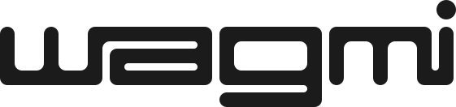

<a name="readme-top"></a>

<!-- PROJECT LOGO -->
<br />
<div align="center">
  <a href="https://github.com/levblanc/web3-blockchain-solidity-course-js">
    
  </a>

  <h2 align="center">Web3, Full Stack Solidity, Smart Contract & Blockchain development with JavaScript</h2>

  <p align="center">
    My Web3 full stack Solicity smart contract & blockchain development journey along with 
    <br />
    <a href="https://youtu.be/gyMwXuJrbJQ"> » this course from Patrick Collins</a>
  </p>
</div>

<br />

<!-- ABOUT THE PROJECT -->

## About The Project

Through out my journey with this course, I keep track of each lesson with
Github, pushed my codes to corresponding repos frequently.

The purpose of this master repo is to setup a connecting point of all my repos,
and as a demostration/documentation of the new skills acquired and the roadmaps
achieved.

<!-- GETTING STARTED -->

## Getting Started

1. Clone your target repo

```sh
# repo links can be found in each lesson's README.md
git clone <repo-link-of-target-lesson>

# example: cloning lesson 0
git clone https://github.com/levblanc/solidity-basics.git
```

2. Install dependencies with `yarn install` or `npm install`

## Skills Acquired





<!-- ROADMAP -->

## Full Course Journey

<a href="https://github.com/levblanc/solidity-basics"></a>

### Achievements

- [x] Blockchain basics
- [x] Solidity basics - languange syntax, gas & transactions
- [x] Compile & Deploy contracts (VM and Testnet)
- [x] Chainlink price feeds

### Skills

[![Solidity]](https://soliditylang.org/) [![Chainlink]](https://chain.link/)
[![Remix]](https://remix.ethereum.org/)

#

### [» Check the main repo of my full web3 journey](https://github.com/levblanc/web3-blockchain-solidity-course-js)

<!-- MARKDOWN LINKS & IMAGES -->
<!-- https://www.markdownguide.org/basic-syntax/#reference-style-links -->

[solidity]:
  https://img.shields.io/badge/solidity-1E1E3F?style=for-the-badge&logo=solidity
[chainlink]:
  https://img.shields.io/badge/chainlink-375bd2?style=for-the-badge&logo=chainlink
[remix]:
  https://img.shields.io/badge/remix%20IDE-181E29?style=for-the-badge&logo=ethereum
